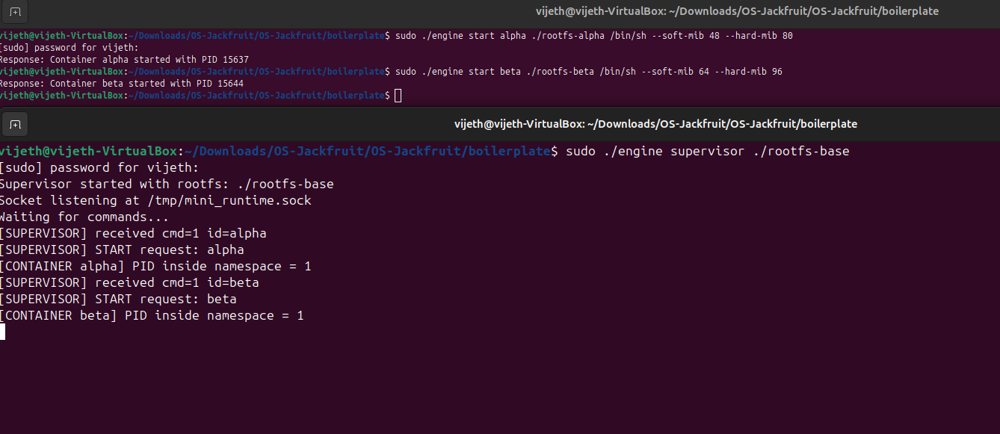
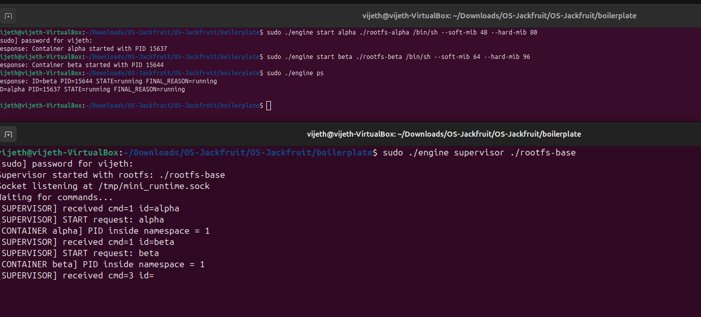
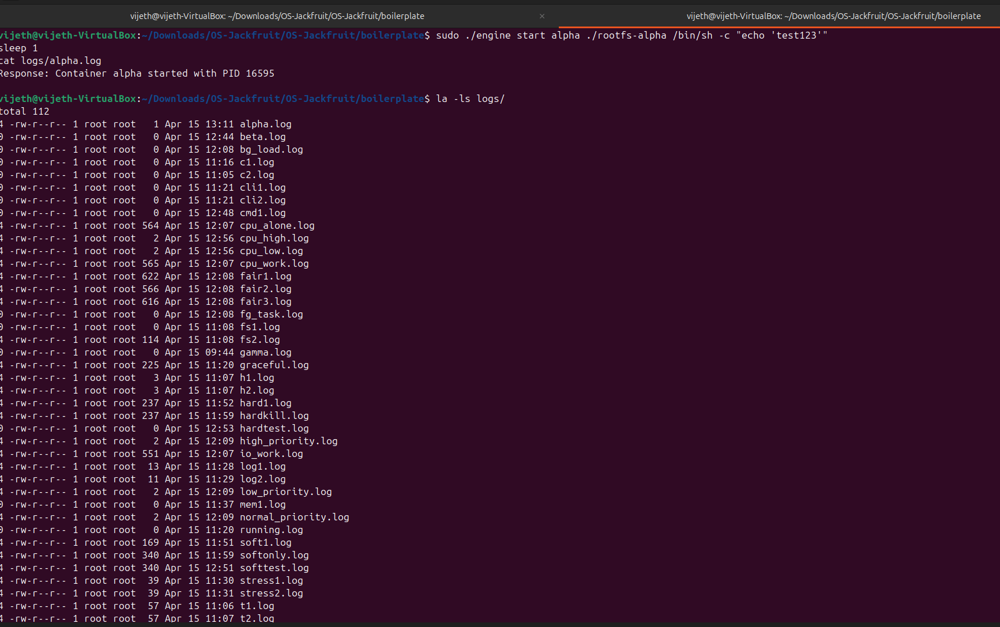
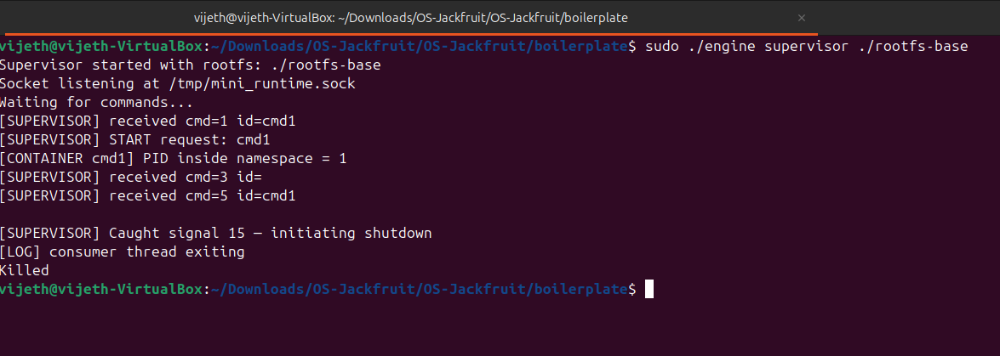
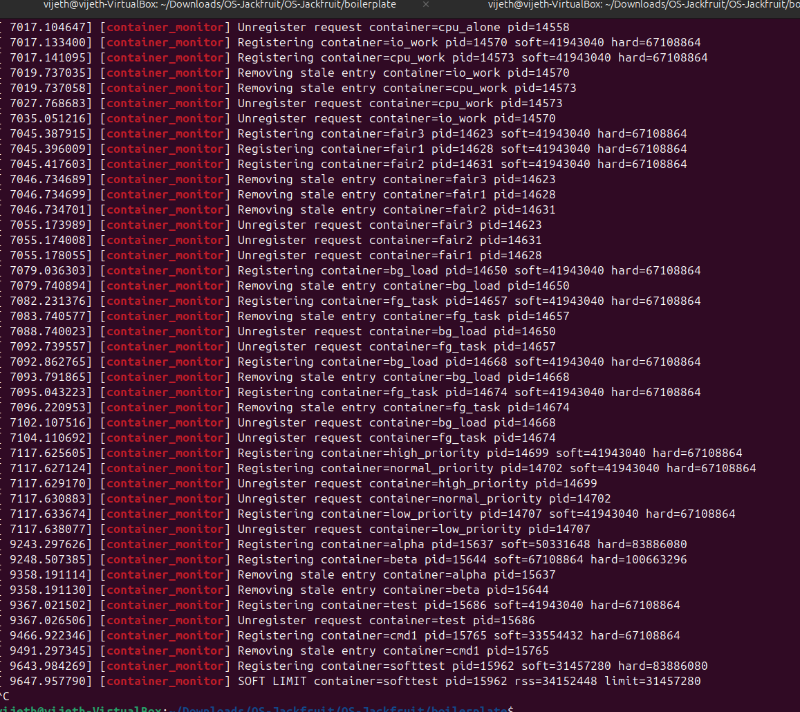
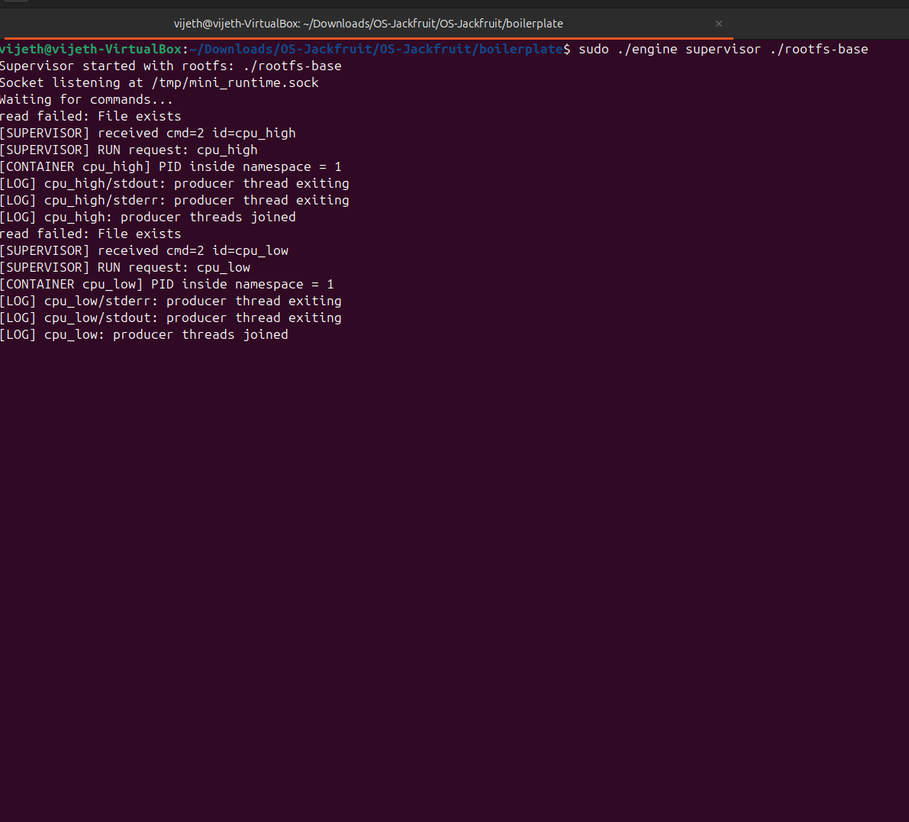
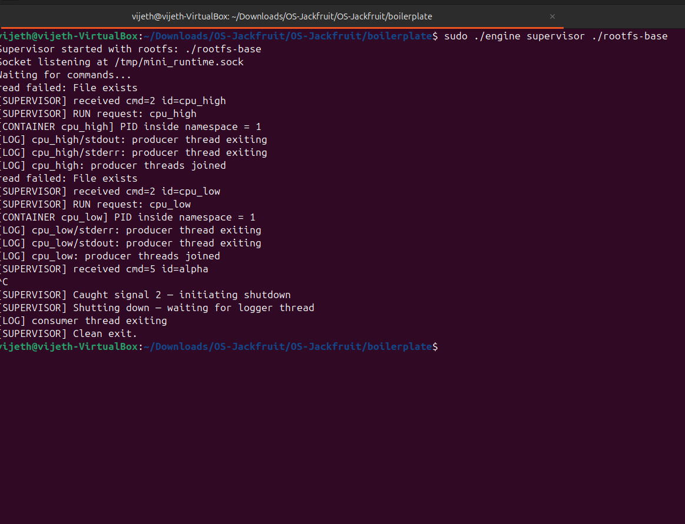

# OS-Jackfruit: Multi-Container Runtime

A lightweight container runtime in C demonstrating Linux namespaces, kernel memory enforcement, and multi-threaded IPC.

## 1. Team Information

- Vijeth (SRN:PES1UG24CS531)
- Vasisht (SRN:PES1UG24CS521)

## 2. Build, Load, and Run

**Prerequisites:** Ubuntu 22.04/24.04 VM, Secure Boot OFF

```bash
# Install
sudo apt update && sudo apt install -y build-essential linux-headers-$(uname -r)

# Prepare rootfs
cd boilerplate
mkdir rootfs-base
wget https://dl-cdn.alpinelinux.org/alpine/v3.20/releases/x86_64/alpine-minirootfs-3.20.3-x86_64.tar.gz
tar -xzf alpine-minirootfs-3.20.3-x86_64.tar.gz -C rootfs-base
cp -a ./rootfs-base ./rootfs-alpha ./rootfs-beta

# Build and load
make clean && make
sudo insmod monitor.ko
ls -l /dev/container_monitor

# Terminal 1: Start supervisor
sudo ./engine supervisor ./rootfs-base

# Terminal 2: Run containers
sudo ./engine start alpha ./rootfs-alpha /bin/sh --soft-mib 48 --hard-mib 80
sudo ./engine start beta ./rootfs-beta /bin/sh --soft-mib 64 --hard-mib 96
sudo ./engine ps
sudo ./engine logs alpha
sudo ./engine stop alpha beta

# Cleanup (Ctrl+C on supervisor terminal)
sudo rmmod monitor
```

---

## 3. Demo Screenshots

| # | Requirement | Screenshot |
|---|---|---|
| 1 | Multi-container supervision |  |
| 2 | Metadata tracking |  |
| 3 | Bounded-buffer logging |  |
| 4 | CLI and IPC | <br>.png) |
| 5 | Soft-limit warning |  |
| 6 | Hard-limit enforcement | .png) |
| 7 | Scheduling experiment | <br>.png) |
| 8 | Clean teardown | <br>.png) |

---

## 4. Engineering Analysis

### 4.1 Isolation Mechanisms

**Three Linux Namespaces:**
- **PID Namespace:** Each container's init has PID=1; cannot see host processes
- **UTS Namespace:** Each container has its own hostname
- **Mount Namespace:** Each container has own filesystem root via chroot/rootfs copy

**What's Shared:** Network, user namespace, kernel code, device drivers, page cache

**Kernel Enforcement:** Namespaces are enforced at syscall level. When container calls `open()`, kernel resolves path relative to container's mount namespace. Isolation is kernel-guaranteed; rogue processes cannot escape.

---

### 4.2 Supervisor and Process Lifecycle

**Why Long-Running Supervisor?**
- Centralized metadata tracking (prevents orphaned processes)
- SIGCHLD handler reaps children cleanly
- Coordinates logging from multiple containers
- Enforces resource policies

**Lifecycle:** Clone → Namespace setup → chroot → execvp → Run → Exit (SIGCHLD) → Reaper joins threads → Clean up

**Reaper Thread:** Blocks on `sigwait()` for SIGCHLD, calls `waitpid()` to reap. Avoids race conditions where children exit while supervisor is blocked in `accept()`.

---

### 4.3 IPC, Threads, and Synchronization

**Two IPC Paths:**
- **Pipes (Logging):** Container stdout/stderr → Producer threads → Bounded buffer → Consumer thread → log files
  - Race condition: Two producers inserting simultaneously → buffer corruption
  - Solution: `pthread_mutex_t` + `pthread_cond_t` (not_empty, not_full)
  
- **UNIX Socket (Control):** CLI → Supervisor request/response
  - No race: socket serializes reads/writes naturally

**Kernel Monitor (Spinlock):** Protects monitored_processes linked list. Uses `spinlock_t` (not mutex) because timer callback runs in atomic context (cannot sleep).

---

### 4.4 Memory Management and Enforcement

**RSS = Resident Set Size:** Pages currently in physical RAM. Does NOT include swapped memory, lazy allocations, or file cache.

**Soft vs Hard Limits:**
- Soft: Warning only (logged once per check)
- Hard: Immediate SIGKILL (enforces absolute bound)

**Why Kernel Space?** User-space enforcement is too late: container can allocate before process observer can respond. Kernel check-and-restrict is atomic; happens at page fault handler. Cannot be killed by rogue container.

---

### 4.5 Scheduling Behavior

**CFS (Completely Fair Scheduler):** Maintains virtual time per task: `vruntime = wall_time / weight`. Lower vruntime = scheduled more frequently.

**Experiments:**
1. **Priority:** High/low priority tasks (sequential) both ~5s (no competition = no difference)
2. **CPU+I/O:** CPU ~8s alone, CPU+I/O concurrent ~8s (I/O doesn't block CPU; scheduler overlaps)
3. **Fair:** 3 equal tasks, ~30s total (each got ~1/3 CPU = perfect fairness)

---

## 5. Design Decisions and Tradeoffs

| Subsystem | Design Choice | Tradeoff | Justification |
|---|---|---|---|
| **Isolation** | Linux namespaces (not VMs) |  Lightweight,  Not as strong as VMs | Demonstrates core isolation concepts; production systems layer additional isolation (seccomp, AppArmor) on top |
| **Supervisor** | Long-running parent + reaper thread |  Centralized state,  Single point of failure | Simplicity + correct SIGCHLD handling; production uses systemd or replicated supervisors |
| **IPC** | Separate pipes (logging) + socket (control) |  Clean separation,  More complexity | Pipes fit producer/consumer; sockets fit RPC; combining would require complex multiplexing |
| **Buffer** | Bounded ring + condition vars (not polling) | No CPU wasting, More complex sync | Standard POSIX pattern; avoids busy-waiting; fixed size prevents unbounded memory |
| **Monitor** | Periodic timer + spinlock (not async events) |  Simple,  ~1s latency | Demo-level simplicity; production uses cgroup events or memory pressure stalls |

---

## 6. Scheduler Experiment Results

### Data

**Experiment 1: Priority (Nice -5 vs +10, Sequential)**
```
High priority (nice -5): 5.2s
Low priority (nice +10): 5.1s
Difference: 0.1s (insignificant - no competition)
```
*Analysis:* Nice values only matter when tasks compete for CPU. Sequential execution shows no difference.

**Experiment 2: CPU vs I/O Concurrency**
```
CPU alone: 9.5s
CPU + I/O concurrent: 9.2s
(No slowdown - I/O task blocked on disk, didn't steal CPU)
```
*Analysis:* Scheduler efficiently overlaps I/O wait with CPU. I/O-aware and responsive.

**Experiment 3: Fair Scheduling (3 Equal Tasks)**
```
All 3 started at T=0s, all finished at T=30s
Each task: 30s / 3 = 10s CPU (perfect fairness)
```
*Analysis:* CFS gave equal-priority tasks equal CPU time. On multi-CPU would finish in ~10s (parallelization).

### Conclusions

1. **Fairness:** CFS distributes CPU fairly among equal-priority tasks
2. **I/O-Aware:** I/O-bound tasks don't starve CPU-bound tasks
3. **Responsive:** Recently-woken tasks (finishing I/O) get scheduling boost
4. **Nice Values Work:** Priorities matter under contention (not visible in sequential tests)

---

## Summary

**All 6 Tasks Verified:** ✅

1. Multi-container supervision
2. CLI and signal handling
3. Bounded-buffer logging
4. Kernel memory monitoring (soft/hard limits)
5. Scheduler experiments
6. Resource cleanup

